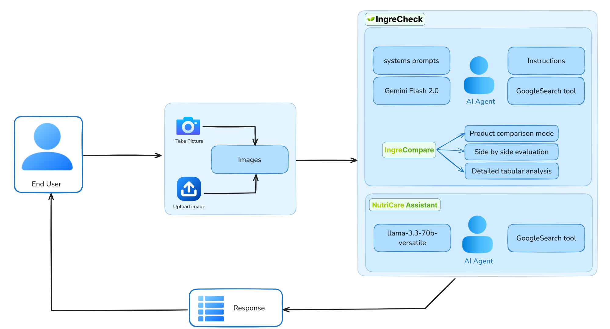

<div align="center" >
      <div style="background-color: white; display: inline-block; padding: 10px; border-radius: 8px;">
        
    </div>
      <h3> Multimodal Agent that analyze product ingredients and provide health and nutrition insights</h3>
  <p>
  
  
  <img src="https://img.shields.io/badge/phidata-red?style=flat&logo=data:image/png;base64,iVBORw0KGgoAAAANSUhEUgAAALQAAAC0CAYAAAA9zQYyAAAACXBIWXMAAAPoAAAD6AG1e1JrAAAQyklEQVR4nO2diZtU1ZnG+Stua3QUTcSFiXGJS0wydUEUpVtAWRSwFQOKCooyYlSiBgSJIhg1RMWILOMjBIKKjCGIiomAKANGQFEEBRdcIDDsCJ7fPN89VdXVG3R1d9W9VfOe53ktu+mHLt7vd7767lnboKZWRq1N3G+AgwdgxzbcV5/BZ+thwwew+m3cqmWwcjEsew3eWgj/eBkWzqnRq2n9dQZu7lSYOy16labm7UHGO/My62vG40UvwZIFPgZLX4Hli3xs1ryD27AWPt8A//oGdm6HvXv+HwG9bw9s3oj7aBXuvbe8SWbYrEnw1Bh48FYYNQh3VzXccDFc3xl+FcLlZ+F6nY6ragcdfwCdjq7R+UdBWAFh4F9TgZRqpgcZ/8zTTkdl/XUXH4e77MfQ+wzoeRqu37k4i83gLjDiKrjvevjD3fCnsbjpj/iO8M7r8O4S+HgNfPMl7N1dBkDv3+f/MZZxVy7GPT8ZHhgKN3eDK87KATFjqL3mwJmV/3OX+3X2Zy0IuT8r0RoeZOKQqutvzvfqxSqo0UXHQa/T4NYe8OgI3Oyn/Cftxo9gy1fw3f7SAdpt2wJffgrzZ8L9Q6D6Z3XMqQusVHYepGono+z/9/+l/yR+5S+ekd07Ewq0c7BrB6xbBeOH46IMnJNJlUXjhyxMgCIW0pD3OBVmPg4b18GeXSQH6IMHcOtWw9iboOORtXtn3AZKJLukCXDdT4FJo2Hr1wkA2kYnnpsIXY6P3ySJkvag6gQ/2tLCMqTZQLsPVsCwnjUfI1HPU1aOHYywxFT3E33U9fD5+uIC7RbMwl39i1p1slOdHD8cYRmo4xEwoCO8/mJxgHZTxoONS6pGjj/4ZSYXPTCmv+55mp+jKCjQU8dDt1NysrJKjLghKF8FHmobCSkI0M+Mg+7ta09qSPIgLKAH0fDeT/KC+vBAf/89PPsIdD05PYaoIKojVxTcg+iZLJWTqf/yVCsB/fJzHmbVzAI5LK4H2YEGS6S9Tvfrf1oE9Ib3od85mixRaUX8HgQwIPRrg5oF9PatMOJqlRmxB1Ii14O7qg85+dIw0Ae+w9mQSW7vkLHyIIzbg/Qz3Nxpfh19k4G2hfad2yqAsQdQIteDzEOiTZN/+hHOFsUdFmgrNR4bITMFE8n0IF0tTLi9wdKjPtBrlkPljxLwxiV5UNG4B7ar5pMPDwP0jm0w+cE6C7MleVCRPA+Mz0dH+IqiUaBtXXNmAkUPgvEHTeKQQFefB5s3NQL0/r3w4lSBLIgoHQ8Cvyk3Z49iDdCff+J38CozJyBQEk0F2vYofru5AaDtLIy+ubOCkjyoSL4HtvH20w/rA+0WzNaDYNzBkcjfgwD+ubQO0Ht2wjMP+jXOMlVghaXkQQBzp/tzYLJA2xkJY29W/Rx7cCSaA/S4YdnRjghot/oduLGLgBZQlKQHQ7v5Iedshl48H3dp+2S8OUkehPl5EA1mvLcsB2jbYXvhMRrhUGeiJD2wkTk7GTVbcsx5Ov43JcmDsLlAB/DaC2mgN63zx9lq/FlAhaXqQQCWlCOg166EiffogTD2oEi0AGhnpxJEQC9fBBOGK0MLKEq65Pj9nWmg502HkdcK6LiDItESoN3vbkkDPWMi3FmtaW8BRUln6JGD0kBbqr6pq4COOygSLQL6P3ulgR4/HAZXCmgBRel6EMAtl6WB/k1/uCalUY7YgyLRkgw9pMoD7Yb1gCvP1UOhgKJ0PQhwdqZ0lKGt9rC9WdoUm4DASDQzQ7v+qXSGHtodtFNFMIUl7IElY2M4ytDXpHCXnRr/m5LkQdgCD7qelM7QdvWwfaG1HAIqLFUPAn8Yf5Sh+5yVPosj7jclyYOKVgC679npA80FlDyoKF0P7O6fqOSwa4xVcsQfEIkWeZDN0FXtoPOxGrYTUJS0Bxe1TQPd4QhdzxZ3MCRa5EHmNuMI6Ow3ddqowKoobQ9qAS3Jg7DEPRDQCQiChIAWBOoIoTK0IAjL3AOVHAkIgoSAFgTqCKEytCAIy9wDlRwJCIKEgBYE6gihMrQgCMvcA5UcCQiChIAWBOoIoTK0IAjL3AOVHAkIgoSAFgTqCKEytCAIy9wDlRwJCIKEgBYE6gihMrQgCMvcA5UcCQiChIAWBOoIoTK0IAjL3AOVHAkIgoSAFgTqCKEytCAIy9wDlRwJCIKEgBYE6gihMrQgCMvcA5UcCQiChIAWBOoIoTK0IAjL3AOVHAkIgoSAFgTqCKEytCAIy9wDlRwJCIKEgBYE6gihMrQgCMvcA5UcCQiChIAWBOoIoTK0IAjL3AOVHAkIgoSAFgTqCKEytCAIy9wDlRwJCIKEgBYE6gihMrQgCMvcA5UcCQiChIAWBOoIoTK0IAjL3AOVHAkIgoSAFgTqCKEytCAIy9wDlRwJCIKEgBYE6gihMrQgCMvcA5UcCQiChIAWBOoIoTK0IAjL3AOVHAkIgoSAFgSJ6QguZa8BpAL/mlGqAqcMHX+ApIqme5CqATmCt9spUNkOLjouAtr/XFA8X1VyCGCam5UjkCtwlSfgBlfCQ7fBjIm4qRPgqTEwoj9cfkZO1hbQypaJ7HCBV8cjoe85MGkMfLmReu377+Fvf4abusIFx+SUJcrQCQiiRLbMSEPd+0x4cz6HbZ+th7uvKU6WVskhUMnXA8uy5x8N9w+hye3t1+HKnxUeagEtoGlOyXHdhQ2XGY21nf8LfxoroPVRn9By4+7+5N3emJcdzlOGjjuQEtlyo8sP4cn78gd6xZtw+ZkqOQRTwoCu/BE8dX/+QL+7BK44q7Blh2roBEBSUgpwBrQN1eXbVi4W0PEHUEJAC4Ly7QiBLzmeHK0MHX8wJFqjhq46ESY/0Lwauq9qaIGYpI6YqoCep8LsSfkDvfwNXLf2hX1/eihMACQlpQD6nYtbMDt/oG2aPNMpBHTcgZSIYAzgVx1g2avNn1gppJfK0AKVJnrgF+sHMPRS2LQ+f6D/OqPwiUFAC2jyLTnuqobdu/KDec8umDKusOVGLaAL/YukMvAg8K+/vzP/7Lx9KzwxqtglRxG3ykil50EqwHU9GWb8MW+e3SdrcfcMKFKGrjoBd+Gx8RsmJdyDAHdrD1j7bv4ZetlrcNXPC9vZOrdNA20LRrqepLIjdmCSrgDG3gz79+UPtG3Fsm1YhczQtkE3Arrv2WAfJbEbJiXXgwB6nwELZtGsNuWhAu8nDKB7+zTQfSxDn6wMHTs0yZUzYB64BXZsyx/mrz/327UK+owmoGOHpHQU4Gw/YFM2xDbUlr8B13YqONCua6bkuPyncMmJCTBOSqYHAcx8HL7bn9ByI62eP0kDPaizr49iN05KngcBbsLtsOWr5sH8r29h5KAiAB1A9XkeaHdbb/+FJlcSAFDcCny9bABaknvsN/DNl82D2cafX33eH19QaKBt2K5/Kp2hf90Hrv5FAsyU8gGv9uGI6e+FTffQNQbzxT/EDa6Cl6bBnt3NhpmDB3BjBhdpwi6A/v+RBnr0DXDdBZopLBWIO1RAVTs/MmW7Rzod3eDJn9T6OrcD5Px9mUMWbR7CMqlNnNiO7k8/pMXttReipaYFP7og828ZeH4aaDtk78YuxSncpfw8sCNpM3BedByu+ucw4uro0BY3bQI8PhJG3whDKmFgJ+ifwtl6ZZsssyMDTJf+ux+j7XV6zff6nRP9bHRgzB1Xgv1ddrpRa7ZiHf8V+RT4zhjV0BN+DUMuUYZO6nLNVBrmh27Dbf3m0BBt34Jbtxr33lJY+gq8tRDm/RduzmS/Htm+984i+Hg17NxOwdrf/xvX5+yaT4CCK8AN6+mB5rmJuDurlaETAHHdIEVgdzwKpo6HA99REm3r1xFcLipziuSV/a6R10W/vg1zp8JvByYggFKtAEVH1v7Az9CVCszWrAS64N+KO2pmfv1uaPTr2/DqCzD2JmXoxHWowIOx6WNKpj3/NM4m6Yo9BGxA2/NEVEOv+R8/3qiHwgRAnBOgDkcQTXodPEhJtOefhkvaxTOfYX49My56G22s5olqNC3wT5ScDcfdOwCcI+nNPT8ZutWs2Izq56L6FcCzj0XvpU303zlPK0MnTRcc7evRhAPt7BnMhgWjTFl8mP3vCyB9tIIHev6fa0iPO5CS98DuMBnchcS2zZvg4dv9wTOZmMVVtl54THYc3QO9ZAHOVisJpgR5EPgZPAMnSW3/PtzCOTC8Dy66DCgnS8bkk7NJIztqLAv0e8v8A4geDBMAck6gOhwJE+8hMW3tu/5saJtpLOY48+E6vt20tW5VDtAbP/IPIIl4g1ItqG29xpIF8dXSW77C2dnOMybC0O44GxvPJL5E8BLAw3fAN1/kAG0HgUQjHXG/OameBwbNNSl4caq/Iq0YYH/9Bax+20+XPzYCBnbEdUjqM1YAs57Mrgz0QFtbNDdBvU7KBiszBW6vv70WXn4O/rk0+vi38y7YvBFna5Z3bMPt3Q0mg74x8J3D2aWY+/b4PYK2PsQ6iq3vWPEPv0N7/G24q3/p12EkKhs3ArStUUm3GqCtjr7ipwl4g1KDQcsFvPOx/nqHIVV+R8j44X7F3NxpMHe6L1GW/A0+ei9arIRp/RoPrH3/7y/DS9Nh+sM4q9Hv6AcDOtZeZpoDsF/xl0DZ+7ryXLCOXQ/oTR/7022sbtPDYfzBampA6y32D+oovaMjd4107qhEScc6gDGD/SdUPaDto8omWBJZJ0nyoKJhoOfPxOUcflMDtDVbS9vDxqMFtQCqKI1x+s821EK4NtA29GHTrQI6AQGTaMCDmnI4wE17GHbtOATQ1la+WaR9YJI8qGi+B7ayb0PNw2CjQDtbfXfvwOzDQnG20EjyoOKwHtRi0cbHd+88PNDYGKXtSbPF5QJNHoQJ8iCVuW/8ePjqs3roNgy0tb27cdmZQz0gxh5IiRoWA9xzExvEtnGgrVnpcUOXmpkq1dQCK4zHg+wYuk2/2x0vhzgFtXGgrb27BNf7TGVqZUjiLTXSgxR2lsj69w+J7KGBtvbiFP9EqaDKgzCmutnKDDswZ96zh8X18EBbe+I+qDxBw3nq1MQBc7TFK70JtnWAtvbHe9PnSOshUWBXFNiDnHUmBrOdMd3E1nSgbYzaoM7J1HpQVBlCwYBOT203MTM3C+ioPTEKV2k1dZz7yKTy9SCIXqMrJp59NG888wf64AGYPcmvx819A7EbIVHKHuQub+17DtGJXs1o+QOdaR+sgGE9lKXjBqHcNMwu91zZbCybD3TmpMkp43HZaXKVIbEDEZaYsudft8XNmhQdCdyS1jKgrdnJmBveh3HD/PW02W08CTBLIrke1OyqcXaP4fsr/D7HFraWA51p2771+xKfHA0XHV8DdrSgJG7zJGL0wDW0ZcyuE3zwVs+M3ZbVSrvZWw/oTNu+1R9IMufpaI+iizbe5u5fU1lS/h0sqLP8OB1zO6Bm1CB/JIN9qn+7udXxa32gc/co2tnG1gPnz4TJD/grcu1ej0vbQ6ejavfazD8+m9nrbuhs5HuxB68MlMpJOLke17uM6FCbcWtfWuR6nQHXd/Yn6z/7CO6NebhVb8Pnn8D+vQXDrnBA1222VeaLTz3gi+f7W5Js+G/SaH/clW3Ft5sEbDWV3fliW/RtMYrdzlR9Hq7v2XDZj/1gu90AFekk3IXHakq+tbY2dW5bx9+TcVUn4qw8sLss7eo0S0iDK/3xWyOu8sCOvRn3h3vAtkTZ0boLZuHeWugBtqRWQIDrtv8DtraiAK9YetMAAAAASUVORK5CYII=&logoColor=red&logoSize=auto&labelColor=white&color=%23FF4016&link=https%3A%2F%2Fwww.phidata.com%2F" alt="phidata Badge">
  
  
  
  </p>
  </div>

## Table of contents
  - [Overview](#overview)
  - [Architecture](#architecture)
  - [Features](#features)
  - [Dependencies](#dependencies)
  - [Project Structure](#project-structure)
  - [Installation](#installation)
  - [Usage](#usage)
  - [Contributing](#contributing)


 ## Overview
**IngreCheck** is an Multimodal agentic AI application that helps you decode the ingredients in the products you use daily. Whether you're uploading an image, snapping a quick photo, or selecting from sample images, this app provides deep insights into what’s inside your products, empowering you to make healthier choices.

The application integrates two powerful tools:
- `IngreCompare:` A tool for side-by-side ingredient comparison between two products.
- `NutriCare Assistant:` A conversational health and nutrition assistant offering evidence-based information, wellness recommendations, and fitness advice.

Together, these features make IngreCheck a comprehensive solution for ingredient analysis, product comparison, and personalized health guidance.


## Architecture



## Features
### IngreCheck Features

| Feature                    | Description                                                                 |
|----------------------------|-----------------------------------------------------------------------------|
| Ingredient Analysis           | Analysis of product ingredients, highlighting healthy or harmful components. |
| Image Upload & Camera Support | Upload images or capture product photos directly for analysis.             |
| Sample Image Selection        | Preloaded product images for quick testing and analysis.                   |
| (IngreCompare) Comparison Mode | Side-by-side comparison of two product ingredient lists.                   |
| Interactive Table Output      | Ingredient information and comparison results are displayed in a tabular format. |
| Agentic AI Approach           | Dynamic and personalized ingredient evaluation powered by AI models.       |
| User-Friendly Interface       | Engages users with a user-friendly interface for better understanding. |

### NutriCare Assistant Features

| Feature                    | Description                                                                 |
|----------------------------|-----------------------------------------------------------------------------|
| Health Information Search  | Finds accurate health and wellness information. |
| Interactive Chat Interface | Provides conversational health and nutrition advice, making the assistant feel personal and approachable. |
| Evidence-Based Insights | Uses advanced AI models to pull accurate, evidence-based nutrition and wellness information. |
| Dynamic Response Output    | Uses structured data, display responses in easy-to-read tables for better understanding. |
| Empathetic Tone            | Ensures a friendly and engaging user experience.        |
| Real-Time Health Assistance| Delivers personalized health guidance instantly. |


## Dependencies

- `python-dotenv`: Library for managing environment variables from a `.env` file
- `streamlit`: Web framework for building interactive applications
- `phidata`: Data science tools and frameworks for efficient processing and analysis
- `pillow`: Image processing library for handling and manipulating images
- `google-generativeai`: Integration for using Google's generative AI models
- `googlesearch-python`: Library for performing Google searches programmatically
- `pycountry`: Library for working with country-related data (essential for googlesearch)


## Project Structure
```
IngreCheck_App
├── IngreCheck.py               # Main application file
├── prompts.py                  # Contains AI prompts and configurations
├── pages/                      # Pages folder for additional app features
│   └── NutriCare_Assistant.py  # NutriCare Assistant feature implementation
├── sample_images/              # Folder containing sample product images for testing
├── assets/                     # Assets folder for frontend elements
│   ├── logo.png                # App logo
│   ├── favicon.png             # App favicon
│   └── [other assets]          # Additional frontend elements
├── .streamlit/                 # Streamlit configuration folder
│   └── config.toml             # Streamlit configuration file
├── requirements.txt            # Dependencies and libraries for the project
└── README.md                   # Project documentation
```

## Installation

1. **Clone the repository:**
   ```bash
   git clone https://github.com/Adityathere/IngreCheck
   ```
2. **Navigate to the project directory:**
   ```bash
   cd IngreCheck
   ```
3. **Create and activate a virtual environment:**
   ```bash
   python3 -m venv venv
   source venv/bin/activate  # On Windows: venv\Scripts\activate
   ```
4. **Install dependencies:**
   ```bash
   pip install -r requirements.txt
   ```
5. **Acquire API keys through [makersuite.google.com](https://makersuite.google.com) and [console.groq.com](https://console.groq.com) and put them in the `.env` file:**
   ```bash
   GOOGLE_API_KEY="ENTER YOUR API"
   GROQ_API_KEY="ENTER YOUR API"
   ```

6. **Run the application:**
   ```bash
   streamlit run IngreCheck/IngreCheck.py
   ```


## Usage

1. Launch the application in your browser.
2. Choose one of the following options to upload a product image:
   - Upload an image file.
   - Take a photo using your device's camera.
   - Select from sample images.
3. View the analysis report generated by the AI model, including insights into the product's ingredients.


## Contributing

Contributions are what make the open source community such an amazing place to learn, inspire, and create. Any contributions you make are **greatly appreciated**.

If you have a suggestion that would make this better, please fork the repo and create a pull request. You can also simply open an issue with the tag "enhancement". Don't forget to give the project a star⭐! Thanks again!

1. Fork the Project
2. Create your Feature Branch `git checkout -b feature-name`
3. Commit your Changes `git commit -m 'Add new feature`
4. Push to the Branch `git push origin feature-name`
5. Open a Pull Request


